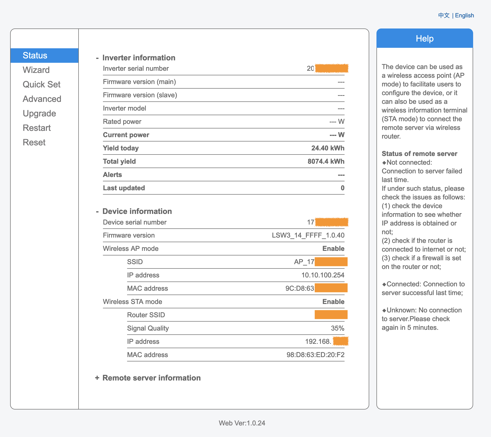
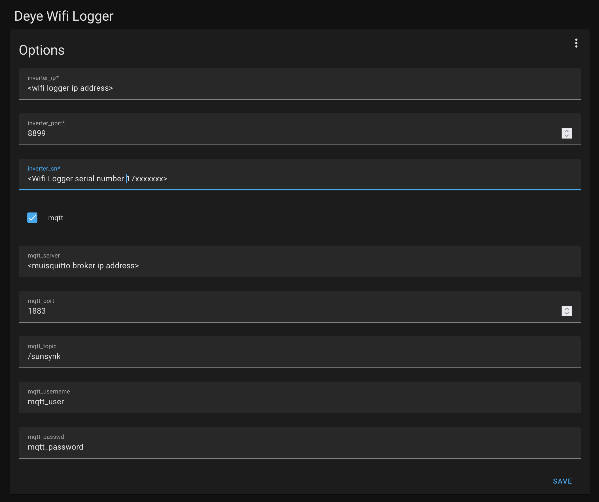
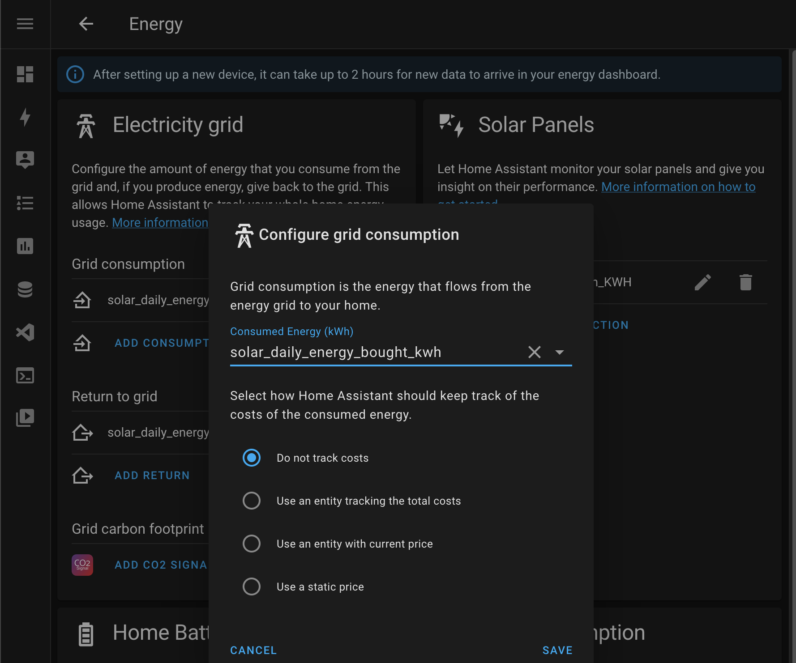
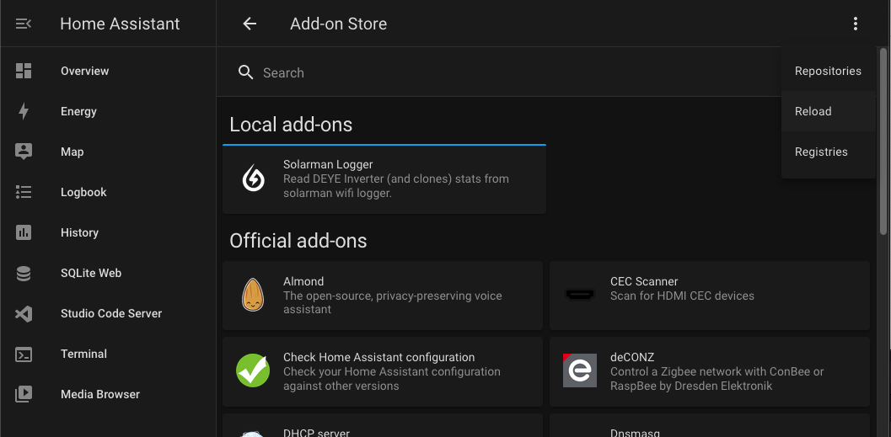

## Overview ##

Tested with a 5kW Sunsynk inverter and Solarman Wifi Stick Logger (LSW-3)

The Solarman Wifi Logger must be reachable via an ip address on the network where Home assistant is located. Configure this add-on with the IP address and serial number of the stick logger to be read and provide the destination mqtt server.

Using the Home Assistant Mosquitto broker add-on as the mqtt destination works really well. I have been using add-on on my Raspberry Pi v4 Home Assistant setup without issues for about a month now.

This add-on is possible thanks to the work of @jlopez77 https://github.com/jlopez77/DeyeInverter
And Modded according, added Battery SOC %

## Solarman Wifi Logger ##

Test connectivity to the Wifi logger by connecting to it's web interface.

Default username/password combination is admin/admin. If you can't access this, it is possible to reset with physical access to the device.

[//]: # ""

### Reset Wifi Logger to factory defaults ###

WARNING! This will wipe all configs

1. Press and hold the reset button for more than 10 seconds
2. Wait for device to reset and start an access point with SSID: AP_17xxxxxxxxx
3. Connect to this SSID using the PSK printed on the device label.
4. Once connected open the device configuration using http://10.10.100.254
5. Configure wifi network access, static IP address etc.

## Add-on Configuration ##

Ensure you configure the add-on before starting it. Setting the mqtt flag to false will configure plugin to attempt to read logger and output result in json format to log file.

    inverter_ip: 192.168.x.x
    inverter_port: 8899
    inverter_sn: '17xxxxxxxx'
    mqtt: true
    mqtt_server: 192.168.x.x
    mqtt_port: 1883
    mqtt_topic: /sunsynk
    mqtt_username: mqtt_user
    mqtt_passwd: mqtt_password

[//]: # ""

## Home Assistant Setup ##

Ensure you create the required mqtt sensors in the homeassistant configuration.yaml to interpret the stats received on the /sunsynk mqtt topic.

    # Solar Inverter sensors setup and all mqtt platforms
    sensor:
      - platform: mqtt
        name: "Solarpower"
        state_topic: "/sunsynk"
        unit_of_measurement: "W"
        json_attributes_topic: "/sunsynk/attributes"
        device_class: power
        state_class: measurement

      - platform: mqtt
        name: "Solar Daily Energy Bought KWH"
        state_topic: "/sunsynk/attributes"
        unit_of_measurement: "kWh"
        value_template: "{{ value_json.daily_energy_bought_kwh }}"
        device_class: energy
        state_class: total_increasing

      - platform: mqtt
        name: "Solar Daily Energy Sold KWH"
        state_topic: "/sunsynk/attributes"
        unit_of_measurement: "kWh"
        value_template: "{{ value_json.daily_energy_sold_kwh }}"
        device_class: energy
        state_class: total_increasing

      - platform: mqtt
        name: "Solar Daily Production KWH"
        state_topic: "/sunsynk/attributes"
        unit_of_measurement: "kWh"
        value_template: "{{ value_json.daily_production_KWH }}"
        device_class: energy
        state_class: total_increasing

      - platform: mqtt
        name: "Solar Battery SOC"
        state_topic: "/sunsynk/attributes"
        unit_of_measurement: "%"
        value_template: "{{ value_json.battery_soc_soc }}"
        device_class: energy
        state_class: measurement

Once these sensors are added to the Home assistant configuration you can use them in the Energy Dashboard to monotor energy usage.

[//]: # ""

This add-on can be run as a homeassistant add-on by copying to the smb://homeassistant.local/addon directory and installing it. Click on reload for the store to scan the local add-on directory if it is not available after copying into place.

[//]: # ""
